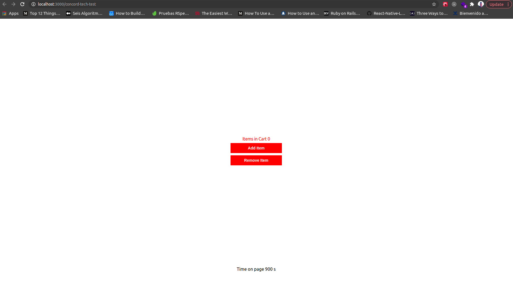
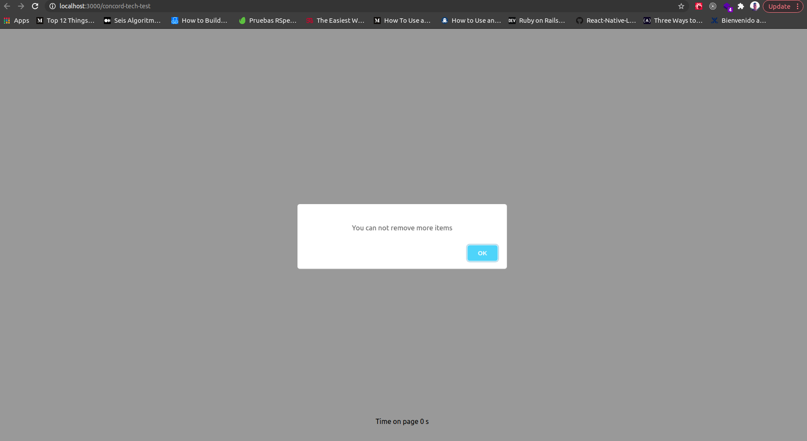
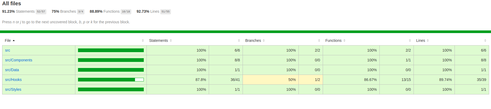
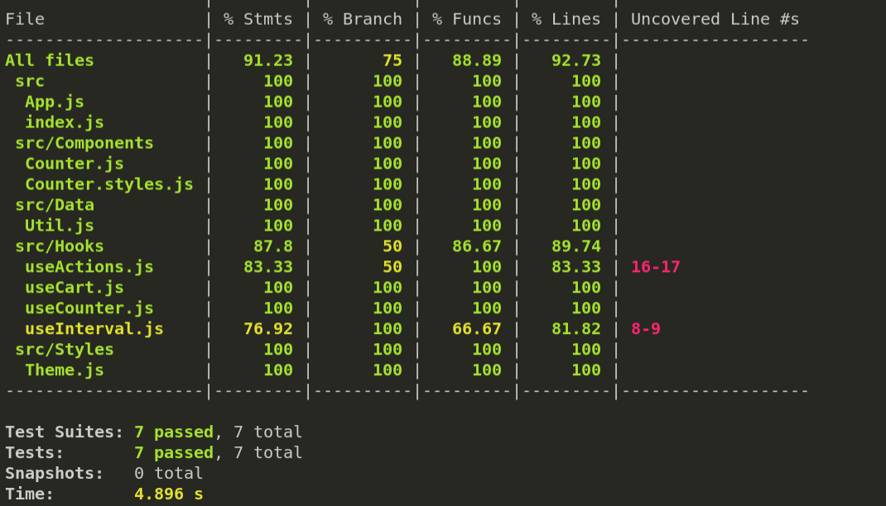

# React Concord Test Counter Hooks

React Coding Challenge.

## Screenshot App

### Home

### Error

## Application In Github Pages

[See the application in https://javierburo178.github.io/concord-tech-test/](https://javierburo178.github.io/concord-tech-test/)

## How Does It Works?

- `yarn or npm install` To install the dependencies.
- `yarn start or npm start` To start the development environment.
- `yarn test or npm test` To run the unit tests.
- `yarn test:coverage or npm test:coverage` To generate the unit test report.

In `App.js` we have a simple front-end that allows a user to click a button to add items to a cart. The current number of items in the cart is displayed in real-time.

## Architecture

Counter app was made with react hooks, isolating all the logic from the components and using just react-hooks and testing all the components and functions.

## Report Test Coverage

### HTML Report

### Console Report

Instructions:

1. Refactor `App.js` to use React hooks, and optimize the component however you see fit

2. Add a button to remove items from the cart, ensuring the count is accurate when adding or removing items

3. Make time on page update every 30 seconds instead of every second

4. Style the component to match the [provided mockup](mockup.png)
